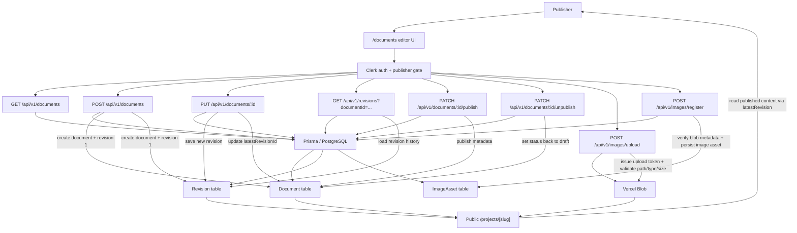
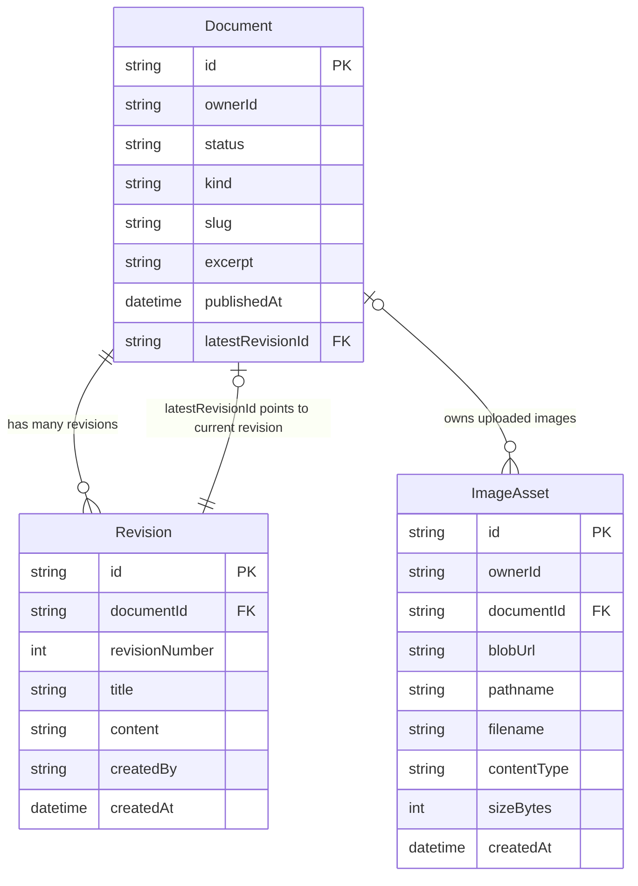

# edwardcho.dev

edwardcho.dev is my personal site and publishing platform, built with Next.js, React, TypeScript, Tailwind CSS, Clerk, Prisma, and PostgreSQL.

It showcases my engineering work while also serving as an experimental product inspired by editorial CMS patterns I use in production: publisher-only content workflows, revisioned documents, document image uploads, and API-backed content management.

Today, the primary workflow is a private, publisher-only document workspace with markdown authoring and revision history. Over time, this repo will also power blog publishing and additional project showcases under the same platform.

## What This Project Highlights

- Publisher-only document lifecycle flows for private content management
- Append-only revision history with latest-revision pointers
- Typed API validation and ownership enforcement
- Monorepo boundaries that separate app runtime concerns from database concerns
- A foundation for expanding private editing workflows into public publishing and additional project surfaces

## Current Capabilities

- Public personal-site pages alongside a private, publisher-only document workspace
- Markdown authoring with live preview
- Revision comparison v1 for comparing the selected revision against older saved revisions
- Document image uploads backed by Vercel Blob and rendered inline in markdown previews
- Clerk-authenticated routes with publisher-only editor and document API access
- Prisma/PostgreSQL persistence with revisioned document history
- Next.js App Router and Route Handler backend patterns
- Reusable UI built with Tailwind CSS and shadcn/ui

## Architecture Diagrams

### Document Editor Workflow



### Document / Revision Relationships



## Near-Term Roadmap

- Draft-to-published workflow for turning editor documents into blog posts
- Public blog routes generated from published entries
- Richer revision comparison, visual diffing polish, and revert support
- Search across drafts and published content
- Additional project showcases integrated into the personal site

## Package READMEs

- [`apps/web/README.md`](apps/web/README.md): app behavior, routes, API, auth testing, and deployment notes
- [`packages/db/README.md`](packages/db/README.md): Prisma schema, migrations, generated client setup, and database lifecycle

## Monorepo Structure

```text
apps/
  web/      Next.js App Router app for the public site, publisher-only document workspace, and API route handlers
packages/
  db/       Prisma schema, migrations, and generated client package for PostgreSQL
  types/    Shared TypeScript types
```

## Quickstart

Prerequisites:
- Node.js `>=18` (Node 22 is currently used in this repo)
- pnpm `9`

Install dependencies:

```bash
pnpm install
```

Run locally:

```bash
pnpm --filter web dev
```

Default local URL:
- Web: `http://localhost:3000`

For environment setup and deeper operational details, use:
- [`apps/web/README.md`](apps/web/README.md)
- [`packages/db/README.md`](packages/db/README.md)

## Scripts

From repo root:

- `pnpm dev` runs package `dev` tasks through Turbo
- `pnpm lint` runs available `lint` tasks (currently `apps/web`)
- `pnpm check-types` runs type checking tasks
- `pnpm test` runs `apps/web` Vitest tests
- `pnpm verify` runs lint + tests
- `pnpm format` formats `*.ts`, `*.tsx`, `*.md`
- `pnpm build` runs package `build` tasks

## Quality Gate

- `git push` runs `pnpm verify` through Husky `pre-push`.
- You can run the same checks manually with `pnpm verify`.
